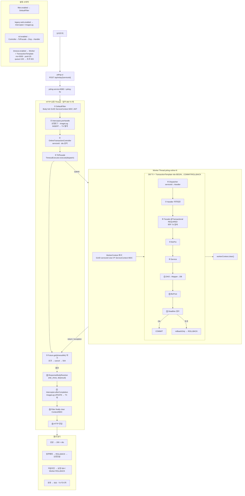

# Big Picture Image — PDMG Online TX

근거: [`00.BigPicture Tx 처리-1.md`](./00.BigPicture%20Tx%20처리-1.md)  
전제: `tcf.enabled=true`, `timeout.enabled=true`, `legacy-web.enabled=true`, `filter.enabled=true`

---

## 한 장 그림 (전체)

```text
╔══════════════════════════════════════════════════════════════════════════════════════════════════╗
║  [브라우저] ──POST──► [pdmg-ui /api/relay/{serviceId}] ──► [pdmg-service:8080 + pdmg-fw]          ║
║                                                                                                  ║
║  설정 스위치                                                                                      ║
║   filter.enabled        → ① DefaultFilter                                                        ║
║   legacy-web.enabled    → ② Interceptor 선/후처리 · ImageLog                                      ║
║   tcf.enabled           → ③④ Controller → TcfFacade → Dispatcher → Handler                       ║
║   timeout.enabled       → ⑤ Worker Thread + TransactionTemplate(rdw) · Future.get(5s)            ║
║   timeout.milliseconds  → 요청 Thread 대기(기본 5000) / overrides.{serviceId} 가능                ║
║   pool-size=20 · queue=100 → 초과 시 FW_OVERLOADED · HTTP 503 (TX 미시작)                         ║
╚══════════════════════════════════════════════════════════════════════════════════════════════════╝

┌───────────────────────────────── HTTP 요청 Thread ─────────────────────────────────┐
│  ★ 업무 DB TX 밖 (시스템 구간)                                                      │
│                                                                                     │
│  ① DefaultFilter                                                                    │
│     Body캐시 · hdr_nhnis · GUID · serviceId · 사용자/IP                             │
│     ServiceContext · MDC · JWT(비-local)                                            │
│                                                                                     │
│  ② ServicePreventionInterceptor.preHandle                                           │
│     요청전문 로그 · 시스템 선처리 · ImageLog INSERT/UPDATE  ◄── 업무 TX와 별개      │
│     (이후 업무 Rollback 되어도 요청 로그는 남음)                                     │
│                                                                                     │
│  ③ OnlineTransactionController   POST /online | /{biz}/online | /{serviceId}        │
│     serviceId 결정 · dto 분리 · 업무로직 없음                                       │
│                                                                                     │
│  ④ TcfFacade                                                                         │
│     TransactionContext.fromCurrent(serviceId)                                       │
│     onlineTimeoutExecutor.execute( () → dispatcher.dispatch(...) )                  │
│                                                                                     │
│  ⑤ OnlineTimeoutExecutor                                                            │
│     ┌─ submit Worker ──────────────────────────────────────────────┐                │
│     │  OnlineTimeoutWorkerContext 복사:                            │                │
│     │  GUID · serviceId · 사용자 · IP · ServiceContext · MDC       │                │
│     └──────────────────────────────────────────────────────────────┘                │
│     Future.get(timeoutMs) 대기  ◄── 초과 시 cancel → OnlineTimeoutException → 504   │
│                                                                                     │
│                    ║ 결과 반환 (성공 Object / 예외)                                   │
│                    ▼                                                                │
│  ⑯ ResponseBodyArgumentResolver   응답봉투 {hdr_nhnis, dto|result} · 응답로그       │
│  ⑰ Interceptor.afterCompletion    ImageLog 응답 UPDATE · 예외정보  ◄── TX 밖        │
│  ⑱ DefaultFilter finally          ServiceContextHolder · ThreadContext clear        │
│  ⑲ HTTP 응답 → 브라우저                                                             │
└─────────────────────────────────────────────────────────────────────────────────────┘
                              │ submit / get
                              ▼
┌────────────────────────── Worker Thread: pdmg-online-N ─────────────────────────────┐
│                                                                                     │
│  ╔═══════════════════ DB TX 경계 = TransactionTemplate(rdw) ═══════════════════╗   │
│  ║  BEGIN                                                                      ║   │
│  ║                                                                             ║   │
│  ║  ⑥ TransactionDispatcher   serviceId → Handler 빈 조회                      ║   │
│  ║  ⑦ TransactionHandler      라우팅만 (DAO/SQL 금지)                          ║   │
│  ║        mgcoa9000S0/C0/… → mgcoa9000Handler → facade.mgcoa9000S0/C0()        ║   │
│  ║                                                                             ║   │
│  ║  ⑧ Business Facade  @Transactional(rdw, REQUIRED)                           ║   │
│  ║        └─ 외부 TX에 참여 (신규 TX 생성 안 함)                                ║   │
│  ║                                                                             ║   │
│  ║  ⑨ BizPrePostAspect  [업무 선처리]  ← Service pointcut, 같은 rdw TX          ║   │
│  ║  ⑩ Service                                                                  ║   │
│  ║  ⑪ DAO → SqlSessionTemplate → Mapper XML → DB (rdwDataSource)               ║   │
│  ║  ⑫ BizPrePostAspect  [업무 후처리]  ← 정상 반환 시; 예외 시 함께 ROLLBACK    ║   │
│  ║                                                                             ║   │
│  ║  ⑬ Deadline 검사                                                            ║   │
│  ║        OK  → COMMIT                                                         ║   │
│  ║        초과 → setRollbackOnly → OnlineTimeoutException → ROLLBACK           ║   │
│  ║                                                                             ║   │
│  ║  ※ Handler도 TX 안. 실질 SQL은 Facade 이후.                                 ║   │
│  ║  ※ rdwTransactionManager 단일 → Executor·Facade·DAO 동일 TX.                ║   │
│  ╚═════════════════════════════════════════════════════════════════════════════╝   │
│  workerContext.clear()                                                              │
└─────────────────────────────────────────────────────────────────────────────────────┘


┌──────────────────────────── 결과 분기 (한눈에) ─────────────────────────────────────┐
│                                                                                     │
│  [성공]                                                                             │
│   Filter → 선처리 → Worker TX BEGIN → Disp/Handler/Facade                           │
│   → BizPre → Service → DAO → BizPost → Deadline OK → COMMIT                         │
│   → 시스템 후처리 → HTTP 200 + dto                                                  │
│                                                                                     │
│  [업무 예외 BizException 등]                                                        │
│   Worker TX BEGIN → Service/후처리 예외 → ROLLBACK                                  │
│   → GlobalExceptionHandler → 오류전문(result) → 시스템 후처리 → 오류 응답           │
│                                                                                     │
│  [타임아웃 5초+]                                                                    │
│   요청 Thread: Future.get 초과 → cancel → 504 FW_TIMEOUT (먼저 응답)                │
│   Worker: 인터럽트/반환 시 rollbackOnly → ROLLBACK (늦은 COMMIT 방지)               │
│   ※ JDBC 즉시 중단은 미보장 · Deadline 재검사로 Commit 차단                         │
│                                                                                     │
│  [Executor 포화]                                                                    │
│   실행 20 + 큐 100 초과 → OnlineOverloadException → HTTP 503                        │
│   → 업무 TX 시작 안 함                                                              │
│                                                                                     │
│  [TX 안/밖]                                                                         │
│   밖: Filter · Interceptor(선·후) · Controller · TcfFacade(대기) · 응답 Resolver    │
│   안: Dispatcher · Handler · Facade · BizPre/Post · Service · DAO · Deadline        │
└─────────────────────────────────────────────────────────────────────────────────────┘
```

---

## Mermaid (동일 내용)



---

## 핵심 한 줄

**요청 Thread는 시스템 선·후처리만, 업무·DB는 Worker의 `TransactionTemplate` 한 건에 Dispatcher~Handler~Facade~BizPre/Post~Service~DAO가 묶이며, 타임아웃은 요청 504 후 Worker Deadline으로 늦은 Commit을 막는다.**
